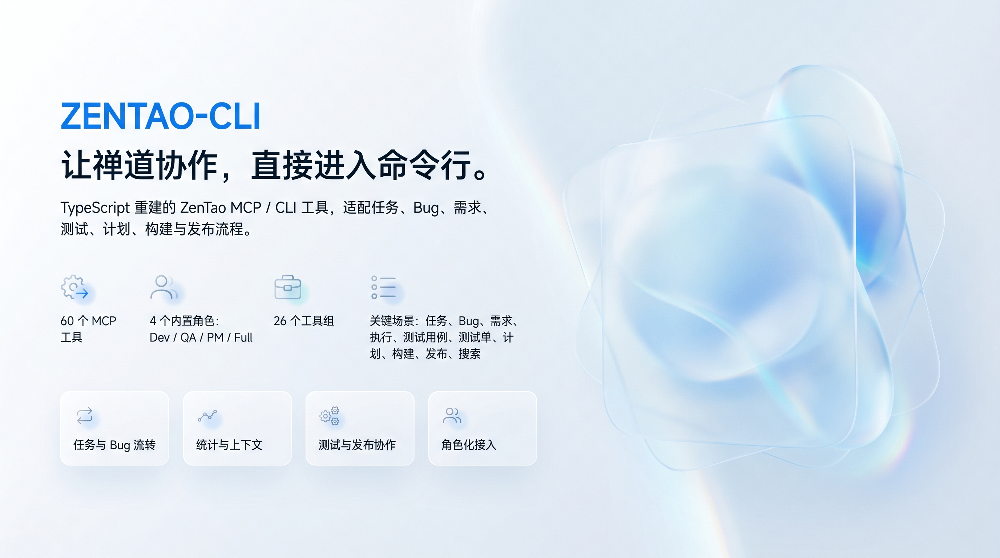

# @cloudglab/zentao-cli



把禅道任务、Bug、需求、执行、测试、构建、动态和统计能力接到命令行，方便在终端、脚本、CI 和 AI Skill 里直接调用。

除了标准 REST API，本工具还补充了部分扩展场景：会在必要时读取页面 JSON、详情页动作记录，或模拟禅道前端请求，把标准接口不好覆盖的查询、统计和流转动作封装成可调用命令。

## 这版补了什么

- 默认 JSON 输出现在更适合 AI / 脚本消费：支持全局 `--output compact|normal|verbose`，并在命令结果里统一附带 `meta.requestCount`、`meta.durationMs`。
- 新增 3 个短链路快照命令：`getBugSnapshot`、`getDevelopmentContextSnapshot`、`getExecutionSnapshot`，把常见“先查详情再查关联列表”的多跳查询压成一步。
- `zentao help <command>` 现在会显示 `预估成本` 和 `下一步` 推荐命令，便于 Agent 自动选择更便宜、链路更短的调用方案。
- HTTP 读取链路补了轻量缓存和网络重试，常见 GET 查询在短时间内重复调用时会直接命中缓存，并通过 `cacheHit` 标记告知调用方。
- `zentao install` / `zentao update` 安装 skill 时统一改为非交互全局 agent 安装，更适合脚本、CI 和 Agent 环境。

### 典型变化

- **输出模式**：`zentao --output compact getBugDetail --bugId 123` 会自动裁剪长步骤、长列表；`--output verbose` 可保留完整原始字段。
- **执行快照**：`zentao getExecutionSnapshot --executionId 2140` 会一次返回执行 focus、构建摘要、未关闭 Bug、逾期任务和最近动态。
- **开发上下文快照**：`zentao getDevelopmentContextSnapshot --entityType story --entityId 10154 --productId 153` 会直接返回需求 focus、关联 Bug、测试用例和摘要。
- **命令帮助增强**：`zentao help getExecutionBugs` 会显示 `预估成本：medium` 和建议继续调用的 `getBugSnapshot` / `getExecutionSnapshot` / `getExecutionDetail`。
- **安装更新体验**：skill 安装统一走非交互 `--global --agent universal --yes`，减少交互式安装卡住的问题。

## 版本要求

- **禅道版本**：优先适配禅道 **18.5** 的 REST v1 API，部分扩展能力依赖旧版页面 JSON，建议目标环境为 18.x 系列。
- **Node.js 版本**：需要 **Node.js >= 16.0.0**。推荐在 Node 18/20/22 LTS 上运行，以获得更稳定的 `fetch`、定时器和子进程行为。

## 安装方式

### 推荐：一键安装 CLI + Skill

```bash
npx -y @cloudglab/zentao-cli@latest install
```

该命令会安装全局 CLI 和内置 Skill，并在禅道配置缺失或登录校验失败时引导输入配置。配置完成后可以执行写操作；真实写入仍需要显式传入 `confirm=true`，也可以通过 `ZENTAO_DISABLE_WRITE=true` 临时禁用写入。

安装成功后会打印 `zentao-cli` ASCII 标识、快速开始命令和写操作提示，便于直接复制下一步命令：

```text
快速开始：
  zentao help                    查看帮助
  zentao list                    查看可用命令
  zentao whoami                  校验当前账号
  zentao getMyTasks --limit 10   查看我的任务
  zentao getMyBugs --limit 10    查看我的 Bug
```

如果需要强制重新下载 npm 静态包，可改用 npm 模式：

```bash
npx -y @cloudglab/zentao-cli@latest install --skill-source npm
```

npm 模式会下载 `@cloudglab/zentao-cli` 包，解压其中的 `skills/` 目录，再通过本地路径安装 skill。

如果需要从 GitHub 仓库安装 skill，可显式指定：

```bash
npx -y @cloudglab/zentao-cli@latest install --skill-source git
```

如果已经提前下载并解压好了 npm 静态包，也可以直接指定本地目录：

```bash
zentao install --skill-local-path ./package
```

后续更新也可以直接运行：

```bash
zentao update
```

`zentao update` 会重新安装最新 CLI，然后从全局已安装的最新 CLI 包内安装 skill，最后校验禅道配置。普通命令每天首次运行时也会做一次轻量更新探针：如果 npm 上存在新版本，会提示可执行的更新命令，但不会自动修改本机环境。只是更新工具、不想被配置校验阻塞时可以跳过校验：

```bash
zentao update --skip-config-check
```

如果本机旧版 `zentao update` 行为异常，可用最新 npm 包自举更新：

```bash
npx -y @cloudglab/zentao-cli@latest update
```

> 提示：默认安装 / 更新会从 CLI 包内自带 skill 读取。如果个别旧版本 npm 包未正确包含 skill 文件，可临时用 `--skill-source git` 安装 skill。

如果 npm 全局目录或 npx 缓存目录存在上次失败留下的残留目录，安装 / 更新会自动清理并重试一次；若仍失败，可按提示执行手动清理：

```bash
npm uninstall -g @cloudglab/zentao-cli
rm -rf "$(npm root -g)/@cloudglab/zentao-cli" "$(npm root -g)/@cloudglab/.zentao-cli-"*
rm -rf ~/.npm/_npx/
npm install -g @cloudglab/zentao-cli@latest
```

只更新其中一部分时可使用：

```bash
zentao update --cli-only
zentao update --skill-only
```

需要卸载时，默认先打印预览；真实卸载必须显式确认。`npx` 方式适合本机命令已损坏或不想依赖本地旧版 CLI 时使用：

```bash
zentao uninstall
zentao uninstall --confirm true
npx -y @cloudglab/zentao-cli@latest uninstall --confirm true
npx -y @cloudglab/zentao-cli@latest uninstall --confirm true --keep-config true
```

卸载默认会移除 zentao skill、全局 CLI、npm 残留目录和 `~/.zentao/config.json`。如需保留配置请加 `--keep-config true`；也可以用 `--cli-only true` 或 `--skill-only true` 只卸载其中一部分。

如果需要在脚本或 CI 中关闭每日更新探针，可以设置：

```bash
export ZENTAO_SKIP_UPDATE_CHECK=true
```

### 命令速查页

项目提供极简命令速查页，适合复制安装、更新、角色入口、常用查询和环境变量命令：

```text
https://cloudglab.github.io/zentao-cli/
```

页面源码位于 `docs/index.html`，由 GitHub Pages 工作流自动部署。该页面不随 npm 包发布，npm 包只保留 CLI、Skill、README 和 CHANGELOG。

### CI / 脚本里临时使用

```bash
npx -y @cloudglab/zentao-cli@latest --help
npx -y @cloudglab/zentao-cli@latest --role qa getMyTasks --status all --limit 20
npx -y @cloudglab/zentao-cli@latest --output normal getExecutionSnapshot --executionId 2140
```

### AI / 脚本推荐读法

```bash
zentao --output compact getBugSnapshot --bugId 84362
zentao --output normal getDevelopmentContextSnapshot --entityType story --entityId 10154 --productId 153
zentao --output normal getExecutionSnapshot --executionId 2140
zentao help getExecutionBugs
```

- `compact`：默认模式，优先少返回，适合 Agent 首轮探测。
- `normal`：保留 `source`、`page`、`total`、`scanned`、`durationMs`、`cacheHit` 等常用元信息。
- `verbose`：保留原始 JSON，全字段排查时使用。

### 批量写操作示例

以下示例展示的是这次重新对齐 18.5 页面后的推荐写法：

```bash
zentao batchEditTasks \
  --tasks '[{"taskId":12,"name":"联调任务","type":"devel","pri":2,"module":66,"status":"doing","estimate":4,"left":3,"estStarted":"2026-06-01","deadline":"2026-06-02","assignedTo":"dev","consumed":1.5}]' \
  --confirm true

zentao batchEditTestCases \
  --productId 153 \
  --branch 1 \
  --type feature \
  --moduleId 66 \
  --cases '[{"caseId":58191,"title":"登录成功","type":"feature","pri":2,"module":66,"story":10154,"stage":["wait","developed"]}]' \
  --confirm true

zentao batchCreateTodos \
  --date today \
  --todos '[{"name":"跟进线上问题","type":"custom","pri":2,"begin":"0900","end":"1830","assignedTo":"ditto"}]' \
  --confirm true
```

如果某个写命令在禅道 18.5 下没有对应 controller，CLI 会在确认执行时直接报错，而不是继续请求一个必然 404 或语义错误的旧页面入口。

### 全局安装

```bash
npm i -g @cloudglab/zentao-cli@latest
zentao --version
zentao version
zentao help
zentao whoami
```

### Skill 安装

默认一键安装会使用 CLI 包内自带 skill。手动从 GitHub 仓库安装：

```bash
npx -y skills add cloudglab/zentao-cli --global --agent universal --yes
```

如果只能访问 npm，不能 clone `.git` 仓库：

```bash
npm pack @cloudglab/zentao-cli@latest
tar -xzf cloudglab-zentao-cli-*.tgz
npx -y skills add ./package --global --agent universal --yes
```

Skill / Agent 里推荐优先调用本地命令：

```bash
zentao --role qa getMyBugs --limit 50
```

本地没有安装时再退回：

```bash
npx -y @cloudglab/zentao-cli@latest --role qa getMyBugs --limit 50
```

## 环境变量

```bash
export ZENTAO_URL="https://your-zentao.example.com"
export ZENTAO_USERNAME="your-account"
export ZENTAO_PASSWORD="your-password"
export ZENTAO_API_VERSION="v1"

# 可选：非标准部署时指定完整 API 基础地址
# export ZENTAO_API_BASE_URL="https://your-zentao.example.com/custom/api.php/v1"
# 可选：非标准部署时指定旧版页面 JSON 基础地址
# export ZENTAO_LEGACY_BASE_URL="https://your-zentao.example.com/custom"
```

`ZENTAO_URL` 传根域名即可，不要带 `/zentao`。

CLI 参数支持 `--key value` 和 `--key=value` 两种写法；如果参数名拼错，会直接提示未知参数，避免写操作时静默忽略字段。需要确认某条命令参数时，可以运行 `zentao help <command>`，例如 `zentao help getExecutionDetail`。

发布前建议至少执行：

```bash
pnpm check
pnpm release:smoke-query
pnpm coverage
```

`pnpm release:smoke-query` 现在会按命令检查返回内容（ID 命中、列表结构、统计计数、快照字段等），不再只校验退出码；可作为发布前和修复查询命令后的回归手段。

## 可以这样问

下面这些自然语言请求可以交给 AI Skill / Agent 转成对应的 zentao-cli 命令。

### 我的任务和 Bug

- 我今天的 Bug 有多少？
- 获取我的所有任务。
- 看我等待中、进行中或已取消的任务。
- 分页看我的任务。
- 看我当前指派的 Bug。
- 统计我当前任务和 Bug 的状态分布。

### 一段时间内我做了什么

- 分析上周我都干了什么。
- 查一下某个人上周解决了多少个 Bug。
- 看某个人最近 3 天做了什么。
- 拉一下 2026-05-25 到 2026-05-29 的工作清单。
- 汇总我上周的评论、指派、流转和解决记录。
- 按天列出我最近几天处理过的 Bug、任务和评论。

### 执行 / 迭代统计

- 这个迭代有多少个 Bug？
- 这个迭代今天解决了多少个问题？
- 分析某个执行的每日迭代执行统计。
- 生成某个迭代的日报。
- 统计某个迭代今天 Bug 和任务情况。
- 看这个执行的 Bug、任务、参与人员和风险明细。
- 统计延期、reopen、未解决、未及时关闭的问题。
- 看这个迭代的任务完成数、逾期数和工时消耗。

### 禅道页面 URL 查询

- 列出 `execution-bug-1234.html` 里面的 Bug。
- 看 `execution-build-1234.html` 这个执行有哪些版本。
- 看 `execution-dynamic-1234.html` 这个执行最近的动态。
- 从禅道页面 URL 里提取对象类型和 ID，再查询结构化数据。

### Bug 和版本

- 看某个执行下有哪些版本。
- 看某个项目下有哪些发布：`zentao getProjectReleases --projectId 1772`。
- 看某个发布详情：`zentao getReleaseDetail --releaseId 1`。
- 查某个产品下包含关键词的 Bug：`zentao getProductBugs --productId 87 --status all --search 浙江 --limit 100`。
- 查线上 / 生产 / 客户反馈问题时，先判断来源：市场 / 售后 / 客户反馈来源查 `市场和售后问题跟踪`，测试 / 开发自发现来源查 `测试`，再按模块过滤真实业务产品：`zentao getProductBugs --productId <产品ID> --status all --module yj --order id_desc --limit 100`。
- 提一个新的 Bug 并指派负责人。
- 调整 Bug 的优先级、严重程度、模块、关联需求或计划。
- 指派、确认、解决、验证通过、激活、关闭或删除某个 Bug。
- 解决 Bug 时关联到某个版本。
- 解决 Bug 时转需求：`zentao resolveBug --bugId 123 --resolution tostory --confirm true`。
- 查某个执行下已解决未关闭、延期处理或 reopen 过的 Bug。
- 分析 Bug 附件和图片资源：`zentao analyzeBugResources --bugId 123`。

### 需求、产品、项目和测试

- 查某个产品下的需求。
- 创建需求，或指派、关闭、激活、评审需求。
- 查某个产品下的 Bug。
- 查某个项目下的执行列表。
- 查某个产品下的测试用例。
- 查某个测试单详情。
- 创建、更新、完成、激活或删除我的待办。
- 搜索包含某个关键词的需求。

## 场景命中链路

Skill / Agent 处理禅道请求时，优先按下面格式路由：

`用户表达 → 命中链路 → 必要参数 → 缺参追问 → 函数调用链路 → 输出汇总`

### Bug 类

- 查我的 Bug：我的 bug、我负责的 bug、分配给我的 bug、待我处理的 bug → 确认范围 → 调 `getMyBugs` → 过滤/分页 → 汇总。
- 查线上 Bug：线上问题、生产问题、客户反馈问题、售后反馈 Bug → 先判断来源 → 市场 / 售后 / 客户反馈查 `市场和售后问题跟踪`，测试 / 开发自发现查 `测试` → 调 `getProductBugs --module <模块别名>` → 汇总未关闭和近期已解决问题。
- 查 Bug 列表：查 bug、缺陷列表、某产品/执行 bug、未关闭/激活/已解决 bug → 确认产品或执行 → 查询列表 → 汇总。
- 查 Bug 详情：这个 bug 什么情况、复现步骤、当前状态、谁负责 → 确认 `bugId` → 查详情 → 汇总。
- 创建/更新 Bug：提 bug、报缺陷、指派、确认、关闭、激活、解决、改优先级/严重级别 → 补齐必要字段 → 写操作确认 → 调对应命令 → 汇总。

### 任务类

- 查任务：查任务、我的任务、某人的任务、任务进度、父子任务 → 确认 `executionId` 或负责人 → 查询任务 → 按父子结构汇总。
- 拆任务/排任务：拆任务、排任务、按需求建任务、给执行排期 → 确认 `executionId`/请假/周末加班/节假日 → 查询执行任务 → 判断父任务 → 必要时创建父任务 → 创建子任务 → 汇总。
- 调整已拆分任务：用户已给出迭代 / 父任务 / 子任务，且表达“调整、重排、延期、换人、增删其中几项” → 不再走“拆任务/排任务” → 先查 `executionId` 下现有任务 → 定位父任务和受影响子任务 → 给出调整清单 → 写操作确认后调用 `updateTask` / `assignTask` / 必要时 `createTask`。
- 创建/更新任务：建任务、新增任务、挂到父任务下、改负责人/工时/截止时间、开始/暂停/重启/完成/关闭/激活/删除任务 → 补齐字段 → 写操作确认 → 调对应命令 → 汇总。

### 需求和执行类

- 查需求：查需求、需求列表、我负责的需求、未完成需求、需求状态 → 确认产品/项目范围 → 查需求 → 过滤 → 汇总。
- 需求转任务：按需求拆任务、需求转任务、基于需求排期 → 先查需求详情 → 按技术方案/任务实施拆分 → 走拆任务链路。
- 创建/流转需求：创建需求、指派需求、关闭/激活需求、评审需求 → 补齐产品、标题、评审人、结果或关闭原因 → 写操作确认 → 调对应命令。
- 查项目/执行：有哪些项目、当前迭代、`executionId` 是多少、项目下执行、进行中的执行 → 查询可选项 → 让用户确认范围。
- 查发布：项目发布、发布详情、版本发布记录 → 确认 `projectId` 或 `releaseId` → 调 `getProjectReleases` / `getReleaseDetail` → 汇总。

### 特殊扩展场景

- 页面 URL 查询：从旧版禅道页面 URL 解析对象类型和 ID，再返回结构化结果。
- 动态和评论：REST API 缺少完整入口时，读取对象详情或页面 JSON 中的动作记录补全。
- 每日迭代统计：组合执行 Bug、任务、构建、人员和动作记录，生成标准接口之外的汇总视图。
- 附件资源分析：从 Bug / 任务详情解析附件、图片、日志和压缩包线索，下载到本地临时目录；小文本直接内联摘要，图片交给视觉模型或 OCR。
- 写入类补全：标准 REST API 不覆盖的少量动作，会在明确 `confirm=true` 后模拟禅道前端 JSON 请求完成。

### 排期和父子结构

- 默认跳过周末和节假日；只有用户明确周末/节假日加班时才排。
- 创建任务前先查父任务，优先复用“技术方案”和“任务实施”父任务。
- 已拆分任务的调整不是重新拆任务：只有新增独立工作项时才补建任务；改时间、负责人、工时、状态、父子归属时优先更新原任务。
- 最多只创建父子两层，不创建孙任务。

## 查看更新记录

```bash
zentao changelog
zentao changelog --limit 5
zentao changelog --version 0.1.23
zentao changelog --since 0.1.20
zentao changelog --raw
```

> 提示：`zentao help <command>` 现在对 `install`、`update`、`uninstall`、`changelog` 等内置命令也会输出完整参数说明；`zentao --help` 会按当前 role 推荐常用命令，并优先引导使用 `zentao list` 查看全部可用命令。

## 常用命令示例

```bash
# 我的任务
zentao whoami
zentao who am i
zentao help getMyTasks
zentao --role qa getMyTasks --status all --limit 100
zentao --role qa getMyTasks --status wait --limit 50

# 我的阶段性工作清单
zentao --role qa getMyWeeklyActivity --week this
zentao --role qa getMyWeeklyActivity --account some-account --week last
zentao --role qa getMyWeeklyActivity --dateRange 最近3天
zentao --role qa getMyWeeklyActivity --dateRange 2026-05-25到2026-05-29

# 执行 Bug / 构建 / 动态
zentao help getExecutionDetail
zentao --role qa getExecutionBugs --executionId 1234 --limit 100
zentao --role qa getExecutionBugs --executionId 1234 --status all --module yj --search 登录 --limit 100
zentao --role qa getExecutionBuilds --executionId 1234
zentao --role qa getExecutionDynamic --executionId 1234
zentao getProjectReleases --projectId 1772
zentao getReleaseDetail --releaseId 1

# 产品 Bug / 线上问题来源分流
zentao getProductBugs --productId <市场售后产品ID> --status all --module yj --order id_desc --limit 100
zentao getProductBugs --productId <测试产品ID> --status all --module yj --order id_desc --limit 100

# 附件资源分析
zentao analyzeBugResources --bugId 123
zentao analyzeTaskResources --taskId 123 --download false

# 每日迭代执行统计
zentao --role qa getExecutionDailyBugStats --executionId 1234 --iterationName 某个迭代
zentao --role qa getExecutionDailyBugStats --executionId 1234 --iterationName 某个迭代 --date 2026-06-06

# 写操作示例（必须显式 confirm=true）
zentao --role dev assignTask --taskId 123 --assignedTo some-account --confirm true
zentao --role qa createBug --product 1 --title "页面按钮无响应" --openedBuild trunk --steps "复现步骤" --confirm true
zentao --role qa okBug --bugId 123 --comment "回归通过" --confirm true
zentao --role pm createStory --product 1 --title "新增导出能力" --spec "需求说明" --verify "验收标准" --confirm true
zentao createTodo --name "跟进缺陷回归" --begin 09:00 --end 10:00 --confirm true

# 批量操作示例
zentao --role dev batchFinishTasks --taskIds 1 --taskIds 2 --confirm true
zentao --role dev batchAssignTasksTo --taskIds 1 --taskIds 2 --assignedTo dev --comment "请处理" --confirm true
zentao --role dev batchActivateTasks --taskIds 1 --confirm true
zentao --role qa batchResolveBugs --bugIds 1 --bugIds 2 --confirm true
zentao --role pm batchReviewStories --storyIds 1 --storyIds 2 --confirm true
```

## 写操作保护

默认支持写操作；真实写入仍需要在命令参数里显式传入 `confirm=true`。

如需临时禁用写操作，可设置：

```bash
export ZENTAO_DISABLE_WRITE=true
```

## 更多命令

```bash
zentao help
zentao help getExecutionDetail
zentao list
zentao --role qa list
pnpm release:smoke-query
```
